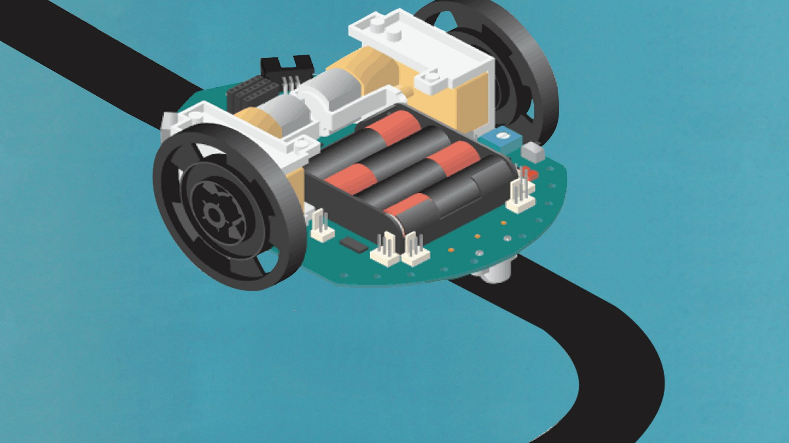

I took courses in web programming, using HTML, CSS, JavaSript and I had contact with computer assembly and maintenance. It turned out that my interest came very early, but I always saw it more as a hobby, I developed some games and deleted them, but I didn't know at the time what Git or Github were.

During my elementary school years, I took part in a science fair, where I was able to develop a trolley that was guided by an LDR inside a black line strip, using Arduino to see how the code worked.

After that event I started researching more things, but I had to focus on high school. So during my 3 years of high school I didn't have any in-depth contact with technology. However, I took a year's sabbatical after high school and during that year I went back to school, finally deciding to go to university to study Systems Analysis and Development.
