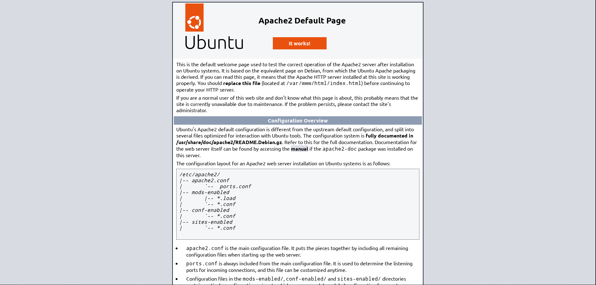

Este faz parte de uma jornada que chamei "DevFólio de Julho", tenho o intuito de fazer 4 projetos voltados para DevOps, direcionando meus conhecimentos de Linux, Docker, Python, Git, entre outras tecnologias. Fiz este projeto no intuito de aprofundar meus conhecimento em Linux e fazer deploy de servidores, relatando minha experiência e problemas que encontrei enquanto fazia o projeto. 

Eu nunca tinha pensado em trazer meus homelabs para o GitHub ou Portifólio, usando um formato de narrativa/auto relato. Minha intenção não é apresentar detalhes técnicos ou coisa parecida, mas mostrar o que estou estudando e o que fiz durante meu estudo.

Me propus a configurar um servidor Apache com um certificado, self-signed por praticidade. Fiz configurações de IP, tornando ele fixo, inseri um certificado para e habilitei o protocolo https. Há algumas coisas que pretendo adicionar a esse projeto, criar 3 tipos de usuários com permissões específicas, grupos, além de fazer o redirecionamento da porta 80 para a 443.

Quando eu começar a fazer landing pages melhores, o que acho difícil acontecer *rs, eu mude a página bonita do Apache pela landing page.
 
Source: <a href="https://github.com/lucasgpalves/apache-server-tls">lucasgpalves/apache-server-tls</a>
